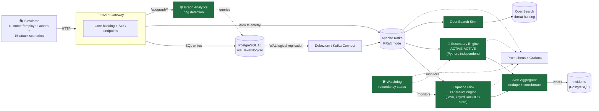

<div align="center">

# Banking Fraud Platform

### A Real-Time, Event Driven Fraud Detection System with Active-Active Risk Engine Redundancy

*A distributed systems case study: Change Data Capture, Kafka-based streaming, stateful Flink scoring, graph-based fraud-ring detection, and a fully redundant, dual-engine detection pipeline. All containerized and reproducible with one command.*

[](https://www.python.org/)
[](https://openjdk.org/)
[](https://fastapi.tiangolo.com/)
[](https://kafka.apache.org/)
[](https://flink.apache.org/)
[](https://www.postgresql.org/)
[](https://debezium.io/)
[](https://opensearch.org/)
[](https://www.docker.com/)
[](https://docs.docker.com/engine/swarm/)
[](https://prometheus.io/)
[](https://grafana.com/)
[](./.github/workflows/deploy.yml)
[](./LICENSE)

[**Read the Full Engineering Handbook**](https://medium.com/@calebmuinde4/the-banking-fraud-platform-handbook-85bca72fe2cf) · [Quick Start](#-quick-start) · [Architecture](#-architecture) · [Tech Stack](#-tech-stack)

</div>

---

## What This Is

**Banking Fraud Platform** is a self contained, containerized simulation of a real-time core banking system paired with a production shaped fraud detection pipeline. There's no real money and no real customers. What it demonstrates is the *architecture* real banks, payment processors, and fintechs use to catch fraud **as it happens**, not in a nightly batch job.

Real-time fraud detection is fundamentally a **latency problem, not a modeling problem**: catching a fraudulent transfer means correlating signals: the login before it, recent account history, entity relationship context arriving from different places at different times, in seconds rather than hours. This repository is a fully working answer to that constraint.

### Highlights

-  **Dual-engine, active-active fraud detection :** A Java/Apache Flink primary engine and an independent Python secondary engine both score every event in real time. Neither is a passive standby; if one goes down, detection keeps running on the other with zero manual failover.
-  **True Change Data Capture :** Debezium tails PostgreSQL's  **(WAL)** write-ahead log directly, so fraud detection sees *everything* that touches the database, not just what the API happens to log.
-  **Stateful stream processing with Apache Flink :** Keyed, checkpointed, RocksDB-backed risk scoring with broadcast-state account enrichment and async I/O historical lookups.
-  **Graph-based fraud ring detection :** NetworkX-powered cycle detection and shared-infrastructure clustering to catch coordinated fraud rings that per-account scoring alone would miss.
-  **A built-in adversary :** A persona-driven traffic simulator plus a 15-scenario attack library (account takeover, wire fraud, money laundering, insider threats, and more) continuously exercises the whole pipeline.
-  **Full observability stack :** Prometheus + Grafana dashboards for application metrics, Kafka consumer lag, cluster resource usage, and live dual-engine redundancy status, plus OpenSearch Dashboards for indexed alert/telemetry threat-hunting.
-  **Verified, not just described :** The accompanying [engineering handbook](https://medium.com/@calebmuinde4/the-banking-fraud-platform-handbook-85bca72fe2cf) cross-checks every architectural claim directly against the source code.

---

## Architecture



*This is the simplified view. The [full, detailed architecture diagram](./fraud-platform-architecture.mermaid) (every topic, every service, every port) lives alongside this README in the repo root.*

---

## Tech Stack

| Layer | Technology | Role |
|---|---|---|
| **API Gateway** |  | Async core banking + SOC case management HTTP API |
| **Database** |  | System of record. Accounts, transactions, incidents |
| **Change Data Capture** |   | WAL-tailing CDC. No application code required |
| **Event Backbone** |  | KRaft mode (no ZooKeeper), Avro-governed topics |
| **Schema Governance** |  | Avro contracts + Confluent wire format |
| **Primary Risk Engine** |   | Stateful, keyed, checkpointed fraud scoring |
| **Secondary Risk Engine** |  | Active-active redundancy for the primary engine |
| **Graph Analytics** |  | Fraud-ring cycle detection, entity graphs |
| **Search & Threat Hunting** |  | Indexed telemetry, alerts, analyst dashboards |
| **Observability** |   | Metrics, cluster resource usage, redundancy status |
| **Local Orchestration** |  | 20-service local dev stack, one command to run |
| **Production Orchestration** |  | Multi-node Swarm deployment (`infra/docker-compose.yml`) |
| **CI/CD** |  | **Every commit to `main` is automatically built and deployed** to the Swarm cluster. No manual deploy step |

---

## Quick Start

### Prerequisites

- **Docker** and **Docker Compose** (Docker Desktop on Mac/Windows, or Docker Engine + Compose plugin on Linux)
- At least **8 GB of RAM** allocated to Docker. This stack runs 20 containers, including a JVM-based Kafka broker and Flink cluster
- Ports `3000`, `5601`, `8000`, `8081`–`8083`, `9090`, `9200`, `9500`, `9601` free on your host (full list in `docker-compose.yml`)

### 1. Clone the repository

```bash
git clone https://github.com/Caleb-Muinde83/banking-fraud-platform.git
cd banking-fraud-platform
```

### 2. Configure environment variables

Copy the example environment file and adjust credentials if needed (defaults work out of the box for local development):

```bash
cp .env.example .env
```

### 3. Bring up the entire stack

```bash
docker compose up -d --build
```

This builds and starts everything: PostgreSQL, Kafka, Schema Registry, Kafka Connect (Debezium), the Flink cluster, both risk-scoring engines, the watchdog, OpenSearch, the simulator, and the full observability stack. Cold start can take a few minutes and several services have generous health-check windows since this is a genuinely deep dependency chain.

### 4. Verify everything is healthy

```bash
docker compose ps
```

Every service should show `Up` (or `healthy`). If anything is stuck, check its logs directly:

```bash
docker compose logs -f <service-name>
```

### 5. Explore the running system

| Interface | URL | What you'll find |
|---|---|---|
| **API docs (Swagger)** | http://localhost:8000/docs | Interactive API explorer — try `/api/login`, `/api/transfers`, `/api/v1/incidents` |
| **Flink Dashboard** | http://localhost:8082 | Live job graph, checkpoints, backpressure for the primary risk engine |
| **OpenSearch Dashboards** | http://localhost:5601 | Threat-hunting UI over indexed alerts and telemetry |
| **Grafana** | http://localhost:3000 | Cluster resource usage + fraud engine redundancy dashboards (default login: `admin` / `admin`) |
| **Prometheus** | http://localhost:9090 | Raw metrics + scrape target health (`/targets`) |
| **Kafka Connect REST API** | http://localhost:8083/connectors | Confirm the Debezium CDC connector registered successfully |

### 6. Watch fraud detection happen live

The simulator starts generating baseline traffic and attack scenarios automatically. To trigger a specific attack on demand instead of waiting:

```bash
docker compose exec simulator python trigger.py --scenario account_takeover
```

Then watch an incident form in real time:

```bash
curl http://localhost:8000/api/v1/incidents | jq
```

### 7. Shut everything down

```bash
docker compose down          # stop and remove containers
docker compose down -v       # also wipe persisted volumes (fresh start next time)
```

---

## Deployment

This repository ships **two distinct orchestration paths**, for two different purposes worth understanding the difference before you touch either:

| | Local development | Production |
|---|---|---|
| **Compose file** | `docker-compose.yml` (repo root) | `infra/docker-compose.yml` |
| **Style** | Single-host, `build:` from source | Docker Swarm stack, pre-built images from a registry |
| **How it starts** | `docker compose up -d --build` (manual) | `docker stack deploy` (automated. See below) |
| **Use it for** | Running the whole platform on your local PC, per the Quick Start above | A real multi-node Swarm cluster |

### CI/CD: commits to `main` deploy automatically

[`.github/workflows/deploy.yml`](./.github/workflows/deploy.yml) runs on a self-hosted GitHub Actions runner and triggers on every push to `main` that touches the API, simulator, config, or infra directories. **There is no manual "click deploy" step** in the pipeline:

1. Builds the `banking-api`, `banking-simulator`, and `banking-postgres` images.
2. Runs `docker stack deploy -c infra/docker-compose.yml fraud_platform`, which reconciles the running Swarm cluster to match whatever's in `main`.
3. Waits for Kafka Connect to come back up, then registers (or updates) the Debezium CDC connector automatically.

In other words: **merge to `main`, and the production cluster updates itself.** No separate deployment repo, no manual `ssh`-and-run-a-script step. This is genuinely continuous *deployment*, not just continuous integration.


## Project Structure

```text
banking-fraud-platform/
├── api/                    # FastAPI core banking + SOC gateway
├── analytics/
│   ├── flink-risk-engine-java/   # Primary fraud-scoring engine (Java/Flink)
│   ├── kafka-stream-scripts/     # Secondary engine (Python, active-active)
│   ├── engine-watchdog/          # Redundancy/liveness monitoring
│   └── opensearch/               # Kafka → OpenSearch ingestion sink
├── simulator/               # Traffic generator + 15-scenario attack library
├── config/                  # Kafka Connect, OpenSearch, and Avro schema configs
├── grafana/ · prometheus/   # Observability provisioning and dashboards
├── infra/                   # Swarm production deployment (docker-compose.yml + Postgres init)
├── docker-compose.yml       # Primary local orchestration (start here)
└── fraud-platform-architecture.mermaid   # Full, detailed system diagram
```

---

## Documentation

The full engineering handbook; architecture deep-dives, design-pattern discussion, a chapter-by-chapter walkthrough of every service, and a candid account of what actually broke during deployment and how it was fixed is published here:

**[**The Banking Fraud Platform Handbook**](https://medium.com/@calebmuinde4/the-banking-fraud-platform-handbook-85bca72fe2cf)**

It's a long read by design built to be read in parts, not one sitting. Start with Chapter 1 for the architectural motivation, or jump straight to the redundancy engineering and observability chapter if that's what brought you here.

---

## Contributing

Contributions, issues, and suggestions are welcome. See [`CONTRIBUTING.md`](./CONTRIBUTING.md) for guidelines.

## License

See [`LICENSE`](./LICENSE) for details.